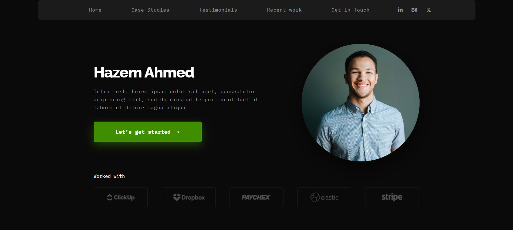
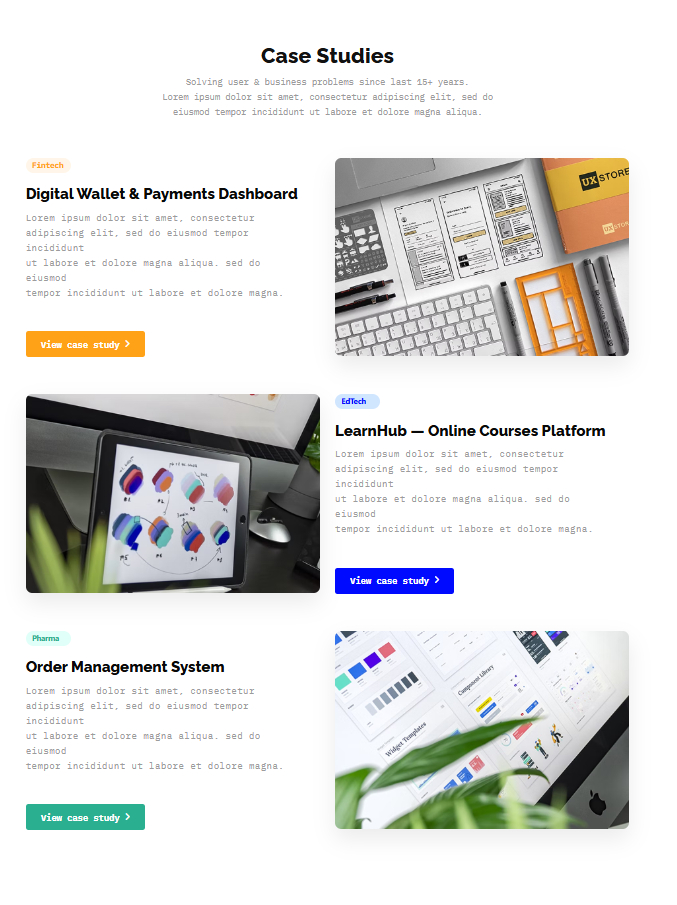
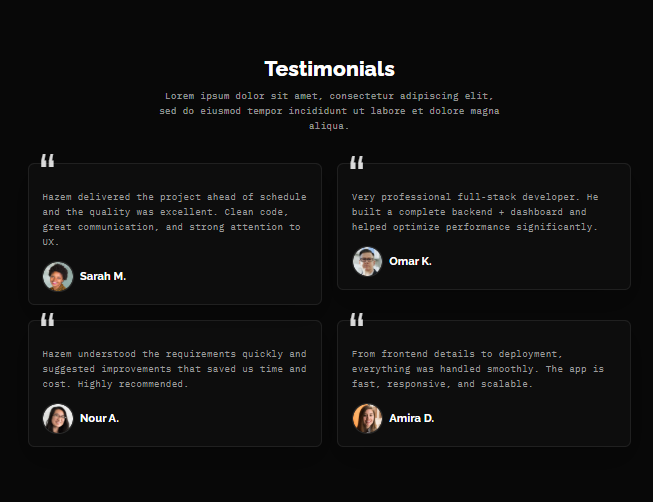

# Bootstrap Website Portfolio

A pixel-perfect, responsive portfolio website built with Bootstrap 5, designed from Figma mockups.

## Screenshots






## Tech Stack

- **HTML5** - Semantic markup
- **CSS3** - Custom styling
- **Bootstrap 5.3.3** - Responsive grid system and components
- **Font Awesome 6.5.0** - Icons
- **Google Fonts** - IBM Plex Mono & Raleway
- **Figma** - Design source (pixel-perfect implementation)

### Key Features
- 📱 Fully responsive design
- 🎨 Pixel-perfect implementation from Figma
- 🔗 Smooth navigation with anchor links
- 💼 Portfolio sections: Case Studies, Testimonials, Recent Work
- 📞 Contact section
- 🌐 Social media integration (LinkedIn, Behance, Twitter)

## How to Run

### Option 1: Direct Open
1. Clone or download this repository
```bash
git clone https://github.com/Hazem-Ahmed1/bootstrap-website-portfolio.git
```

2. Navigate to the project folder
```bash
cd bootstrap-website-portfolio
```

3. Open `index.html` in your browser
   - Double-click the file, or
   - Right-click → Open with → Your preferred browser


## Design
The design was created in Figma and implemented with pixel-perfect accuracy. All spacing, typography, and visual elements match the original design specifications.
